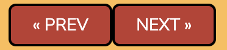
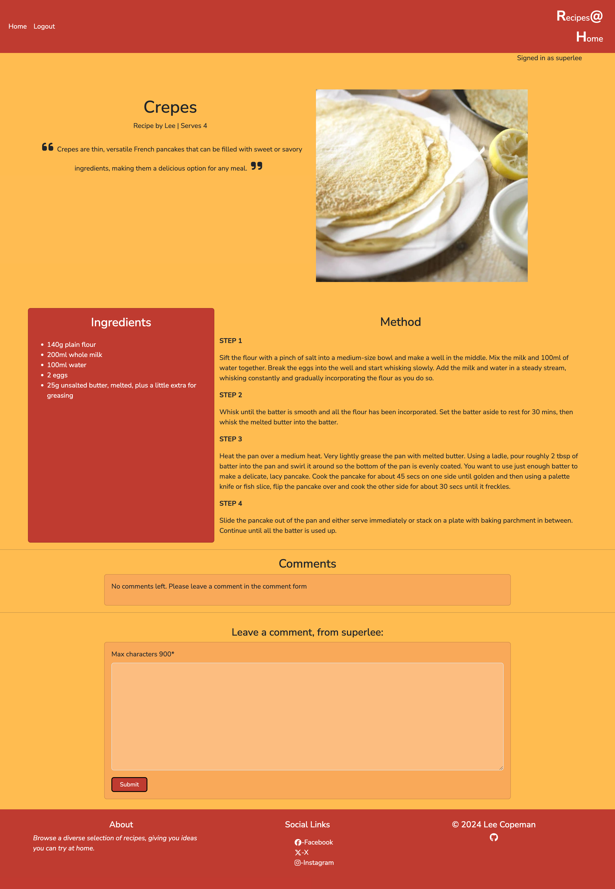
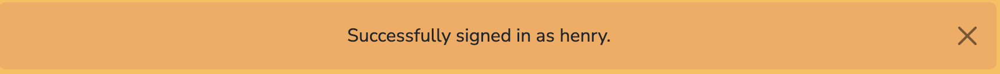

# Recipes At Home

## Features

- Each page has a navbar and a footer

### Navbar 

Navbar has the following links:
- Home page
- Register
- Login
- Logo links to home page 

 

Links that are hovered over are highlighted with black text.

The simplistic design of the navbar is based on the decision to make the use of the webapp easy for the user.

When the app is viewed on smaller screens, the 'Home', 'Register', and 'Log In' links are all hidden within a toggle button. This helps to maintain a clean navbar that is not overcrowded.

- 

Whichever page is currently active, it is displayed by the relevant link being in black text as opposed to white.

- 
- 
- 

When the user is logged in, the navbar looks as follows:

### Footer

- Footer for larger screens
  - 
- Footer for smaller screens
  - 

Footer has the following sections:

- About section, with a brief description of the app:
    - 
- Social Links, links to social media platforms:
    - 
    - All links are underlined when hovered over
    - All links open the relevant social page in a new window
- Developer:
    -  
    - The GitHub logo has hover properties and links to the developers GitHub page
    - The link opens GitHub in a new window    

### Home Page

- When the home page is loaded, the user is able to view a list of the recipes.
- 3 recipes cards can be viewed per page.
- Each recipe card shows:
  - Title
  - Excerpt
  - Image
  - Author
  - Servings per recipe
  - 
  - When the recipe is hovered over, the text is underlined and the opacity changes
  - The recipe can be clicked anywhere on the card to open the recipe

- If the user has logged in, a message displays which user is signed in, in the top-right corner of the page.
  - 

- At the bottom of the page there is a 'NEXT' button, to navigate to the next page of listings
  - 
- After you have left the first page, a 'PREV' button shows, allowing the user to return to the previous page 
  - 
- If there are more than two pages to navigate through, both 'NEXT' and 'PREV' buttons are displayed
  -   
- Both 'NEXT' and 'PREV' buttons have hover properties; background changes to a lighter color and text becomes black  

- For smaller screens, the recipe cards are displayed on top of one another, in a single column
  - 

- If an image is not uploaded for a recipe, a default placeholder image is shown instead
  - 

### Recipe Feature Page

After the user has clicked on a particular recipe card, the recipe opens with a more detailed view. The list of ingredients is shown as well as the method. Below this is the comment section.

  - The title is shown in the top-left of the page. 
  - The recipe author and servings per recipe stated below title. 
  - The excerpt is shown below this inside enlarged quotation marks to make the text stand out. 
  - An image is displayed in the top-right of the page. 
  - The ingredients are displayed within a card, next to the method so they can be easily cross-refereneced.
  - The method is written in easy to follow steps. 

For smaller screens, there is no image displayed. This is to stop the screen being overcrowded and allows for easy navigation around the page.
 

### Comments 

Below each featured recipe there is a comments section. This allows users to leave a comment about the recipe, if they have signed in. Only comments that have been approved by admin will be displayed to all users. The user is able to edit and delete their own comments. 

- If no comments have been left, a message stating this is shown:

- If messages have been left that are yet to be approved, a message stating this is shown:

- If a user is not signed in, they are asked to do so to be able to leave a comment:

- The text `log in` is a link to the sign in page. This text is blue and has hover properties
- When a user is logged in, a personalised form is shown where a comment can be left:

  - A message showing that the maximum characters allowed is 900 is shown
  - The users name is shown in the "Leave a comment, from `user`:" message
  - The submit button can be clicked to send the comment
  - The submit button has hover properties
- A message is displayed at the top of the page when a message has been left:
  
- If the form is submitted empty, a validation message is shown:
  
- When a comment has been left, only the user is able to view the comment until it is approved by admin

  - The author of the comment is shown:
  
  - The time and date that the comment was left is shown:
  
  - A message showing the comment is awaiting approval is shown:
  
- The edit and delete buttons only show if the comment is from the user
- Both buttons have hover properties
- If the user clicks the edit button, the comment can be edited
- The message to be edited populates the comment form ready to be edited
- The cursor is focused on the comment form, for good UX practice
- What was the `Submit` button on the comment form, is changed to `Update`:
- When the message is updated, a message is displayed at the top of the page:

- The user is able to delete one of their comments, with the delete button
- After the initial click, a modal is shown asking for confirmation that the comment should be deleted:

- If the user clicks delete, the message is deleted and a message is displayed at the top of the page:

- If the user clicks cancel, they are taken to the home page.
- When a comment has been approved by the admin, this is how it will be displayed to other users:

### Accounts

To be able to utilise the comment section, users are required to have an account.

#### Log In Page

The log in page allows users who already have an account to log in with their username and password.
  - If a user doesnt have an account yet, there is a link to register:
  - This `Sign Up` text is in blue and has hover properties.
  - If the `Username` field is left empty, a validation message is shown:
  - If the `Password` field is left empty, a validation message is shown:
  - If the username and password have been entered incorrectly, a message is shown:
  - After successfully logging in, the user is taking to the home page, where a message is displayed:
  

#### Register Page

The sign up page allows users to register an account.
  - If the user already has an account, they can navigate to the sign in page:
  - This `Sign In` text is in blue and has hover properties.
  - If the user leaves the username blank, a validation message is shown:
  - If the user enters a username that already exists, a message is shown:
  - If the password doesn't match the criteria shown, messages are shown:
    -
    -
  - After successfully creating an account, the user is logged in and shown a message:

#### Log Out Page

When a user is logged in, they are able to log out via the log out page. The Log Out page ask for confirmation that the user wishes to log out.
 - Both buttons have hover properties. 
 - If they select `Sign Out`, they are signed out, returned to the home page and shown a successful log out message:
 
 - If they select `Cancel`, they are returned to the home page.
