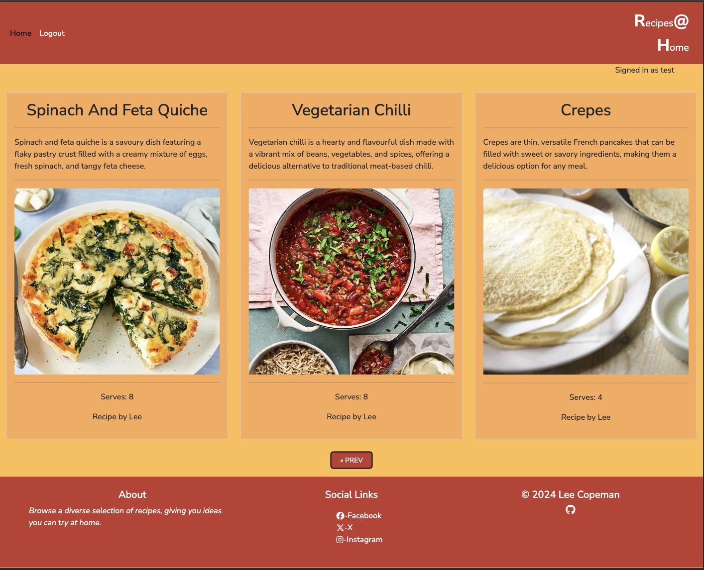
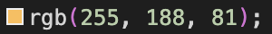
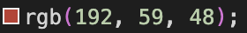
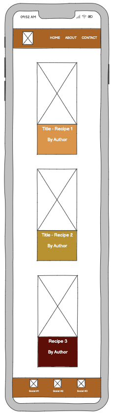
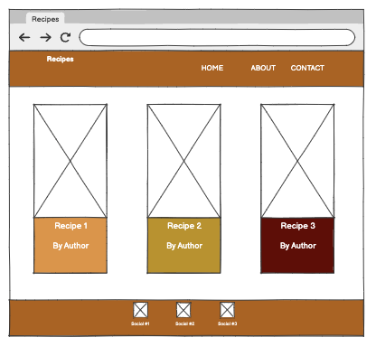
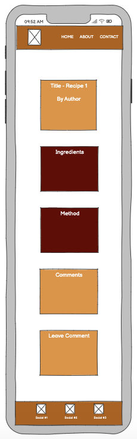
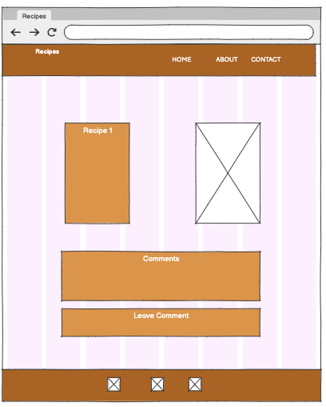
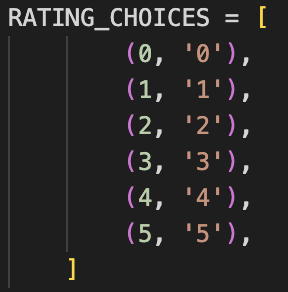

# Recipes At Home

Live Version: [Recipes At Home](https://recipe-project-fd6de57f3d06.herokuapp.com/)


Repository: [GitHub Repo](https://github.com/l-copeman/recipes)

The app is developed by [Lee Copeman](https://github.com/l-copeman).



## About

[Recipes At Home](https://recipe-project-fd6de57f3d06.herokuapp.com/) is an application displaying a range of recipes. The main goal of this app is to inspire people with their cooking in the home, giving recipes that are easy to follow as well as being delicious. 


## User Experience Design

### Strategy

Developed for users who are cooking in the household. The app is designed to be easy to use and intuitive. A selection of recipes are easily viewed, with a title, a short excerpt, the recipe author, servings per recipe and finally an image. An individual recipe can then by viewed, listing the ingredients required for the receipe, and easy to follow steps. As a final goal, the app allows users to leave comments regarding their experiences of the recipe.

### Target Audience

The app was developed for users who are looking to cook in the home. 
  * Young adults and older children: those who are new to cooking and are looking for some inspirarion.
  * Parents: who are looking for ideas to feed their family nutritous and delicious food.
  * Adults: those who are new to cooking and for anyone looking for new inspiration 

### User Stories

#### **First Time Visitor Goals**

| Issue ID    | User Story |
|-------------|-------------|
|[#1](https://github.com/users/l-copeman/projects/2/views/1?pane=issue&itemId=80912650&issue=l-copeman%7Crecipes%7C1)| As a First Time Visitor, I can view a list of recipes so that I can select which recipe I want to view. |
|[#2](https://github.com/users/l-copeman/projects/2/views/1?pane=issue&itemId=80912931&issue=l-copeman%7Crecipes%7C2)|As a First Time Visitor, I can click on a recipe so that I can read the full recipe.|
|[#3](https://github.com/users/l-copeman/projects/2/views/1?pane=issue&itemId=80913658&issue=l-copeman%7Crecipes%7C3)|As a First Time Visitor, I can register an account so that I can comment on a recipe.|

#### **Frequent Visitor Goals**

| Issue ID    | User Story |
|-------------|-------------|
|[#4](https://github.com/users/l-copeman/projects/2/views/1?pane=issue&itemId=80914165&issue=l-copeman%7Crecipes%7C4)|As a Frequent User, I can leave comments on a recipe so that I can be involved in the conversation.|
|[#5](https://github.com/users/l-copeman/projects/2/views/1?pane=issue&itemId=80914542&issue=l-copeman%7Crecipes%7C5)|As a Frequent User, I can view comments on a recipe so that I can follow the conversation.|
|[#6](https://github.com/users/l-copeman/projects/2/views/1?pane=issue&itemId=80915300&issue=l-copeman%7Crecipes%7C6)|As a Frequent User,  I can modify or delete my comment so that I can be involved in the conversation.|

#### **Site Admin**

| Issue ID    | User Story |
|-------------|-------------|
|[#7](https://github.com/users/l-copeman/projects/2/views/1?pane=issue&itemId=80916140&issue=l-copeman%7Crecipes%7C7)|As Site Admin, I can create, update and delete recipes so that I can manage the content. |
|[#8](https://github.com/users/l-copeman/projects/2/views/1?pane=issue&itemId=80916140&issue=l-copeman%7Crecipes%7C7)|As Site Admin,  I can view comments on a recipe so that I can follow the conversation. | |

#### **Future Goals**

| Issue ID    | User Story |
|-------------|-------------|
|[#9](https://github.com/users/l-copeman/projects/2/views/1?pane=issue&itemId=81479751&issue=l-copeman%7Crecipes%7C8)|As a Site User, I can view a video so that I can watch how the recipe is made.
|[#10](https://github.com/users/l-copeman/projects/2/views/1?pane=issue&itemId=83052059&issue=l-copeman%7Crecipes%7C9)|As a site user I can view an about page so that I can understand the purpose of the site and to view more information from the developer.|
|[#11](https://github.com/users/l-copeman/projects/2/views/1?pane=issue&itemId=83052391&issue=l-copeman%7Crecipes%7C10)|As a site user I can leave a rating so that my feedback is given and other users can see it.|

---

## Technologies used

- ### Languages:
    
    + [Python 3.12.2](https://www.python.org/downloads/release/python-3127/): the primary language used to develop the server-side of the website.
    + [JS](https://www.javascript.com/): the primary language used to develop interactive components of the website.
    + [HTML](https://developer.mozilla.org/en-US/docs/Web/HTML): the markup language used to create the website.
    + [CSS](https://developer.mozilla.org/en-US/docs/Web/css): the styling language used to style the website.

- ### Frameworks and libraries:

    + [Django](https://www.djangoproject.com/): python framework used to create all the logic.
    + [Bootstrap 5.3](https://getbootstrap.com/docs/5.3/getting-started/introduction/): a front-end CSS framework library.

- ### Databases:

    + [PostgreSQL](https://www.postgresql.org/): the database used to store all the data.

- ### Other tools:

    + [GitPod](https://gitpod.io/): the IDE used to develop the website.
    + [Pip3](https://pypi.org/project/pip/): the package manager used to install the dependencies.
    + [Django-allauth](https://django-allauth.readthedocs.io/en/latest/): the authentication library used to create the user accounts.
    + [Django-crispy-forms](https://django-cryptography.readthedocs.io/en/latest/): was used to control the rendering behavior of Django forms.
    + [Heroku](https://id.heroku.com/): the cloud platform used to host the website.
    + [GitHub](https://github.com/): used to host the website's source code.
    + [Chrome DevTools](https://developer.chrome.com/docs/devtools/open/): was used to debug the website.
    + [Font Awesome](https://fontawesome.com/): was used to create the icons used in the website. 
    + [Converio](https://convertio.co/): to convert images to webp format
    + [W3C Validator](https://validator.w3.org/): was used to validate HTML5 code for the website.
    + [W3C CSS validator](https://jigsaw.w3.org/css-validator/): was used to validate CSS code for the website.
    + [JShint](https://jshint.com/): was used to validate JS code for the website.
    + [PEP8](https://pep8ci.herokuapp.com/#): was used to validate Python code for the website.

---

## FEATURES

Please refer to the [FEATURES.md](FEATURES.md) file for all features-related documentation.


---

## Design

### Color Scheme

The chosen color scheme for the project, is a selection of deep reds and oranges. These colors were chosen because of their association with warmness, happiness and enthusiasm. The colors are also very autumnal, which is traditonally harvest time for many people. This helps build a connection between food and the content viewed on the project.

- 
  - Was used for the body of the project
- 
  - Was used for the recipe cards and message section
- 
  - Was used for the header/footer and ingredients card
- 
  - Was used for the delete modal and text field in the comment form


### Typography

The main font used in the application is Nunito Sans. The font-family was chosen due to its readability, which increases user experience.

  

  

  


### Imagery

The images used for the recipes were downloaded from the following sites:

- [Crepes Image link](https://pixabay.com/photos/pancakes-yummy-dessert-3926009/)
- [Vegan Katsu Image link](https://www.pexels.com/search/katsu/)
- [Cookie Image link](https://www.pexels.com/search/choc%20chip%20cookie/)
- [Vegetarian Chilli Image link](https://unsplash.com/photos/a-bowl-of-food-VAbBclifmvY)
- [Cheese Straw Image link](https://www.vecteezy.com/photo/47277296-cheese-sticks-with-herbs-on-a-white-surface)
- [Spinach and Feta Quiche Image link](https://www.pexels.com/search/quiche/)

Images were converted to `webp` format with Convertio to reduce size and therefore increase load time to improve UX.

[Font Awesome](https://fontawesome.com/) was used for the icons in the app.


### Wireframes

Wireframes were used to give visual views of how the pages should display the information. These were a first draft, so some stylings and colors are not represented in the finished project.

- Mobile Phone layout for homepage. 
  - 
- Laptop layout for homepage. 
  - 
- Mobile Phone layout for recipe feature. 
  - 
- Laptop layout for recipe feature. 
  - 

---

## Information Architecture

### Database

- The database used for the project is PostgreSQL.

### Entity-Relationship Diagram

#### Allauth's User model.

| Name          | Field Type    | Validation |
| --------------|-------------- | ---------- |
| UserName      | CharField     |  max_length=150, blank=False, null=True, unique=True    |
| Email         | EmailField    | max_length=50   |
| Password      | TextField     | min_length=8, blank=False, null=False    |

---

 #### Recipe

| Name          | Field Type    | Validation | Key  |
| ------------- | ------------- | -------------  | ----------|
| Title         | CharField     | max_length=300, blank=False, null=False, unique=True    |
| Slug          | SlugField     | max_length=300, unique=True    |
| Author        | User Model    |     | ForeignKey
| Serves        | PositiveInteger Field  | blank=False, null=False    |
| Ingredients   | TextField     | max_length=900, blank=False, null=False    |
| Method        | TextField     | max_length=3000, blank=False, null=False    |
| Created On    | DateTime      | auto_now_add=True    |
| Status    | IntegerField      | choices=STATUS, default=0    |
| Excerpt       | TextField     | max_length=900, blank=False, null=False      |

STATUS:
  - 

---

#### Comment

| Name          | Field Type    | Validation | Key
| ------------- | ------------- | ---------- | --------|
| Recipe        | Recipe Model     |     | ForeignKey
| Author        | User Model    |     | ForeignKey
|  Body         | TextField     | max_length=900, blank=False, null=False    |
| Rating        | IntegerField     | choices=RATING_CHOICES, default=0    |
| Approved     | BooleanField     | default=False    |
| Created On    | DateTimeField  | auto_now_add=True    |

RATING_CHOICES:
  - 

---
## Testing

Please refer to the [TESTING.md](TESTING.md) file for all test-related documentation.

---

## Deployment


- The app was deployed to [Heroku](https://id.heroku.com/).
- The app can be reached by the [link](https://recipe-project-fd6de57f3d06.herokuapp.com/).

## Heroku Deployment

- Set up a local workspace on your computer for Heroku:
    - Create a list of requirements that the project needs to run:
      - type this in the terminal: `pip3 freeze > requirements.txt`
    - Commit and push the changes to GitHub
    
- Go to [www.heroku.com](www.heroku.com) 
- Log in or create a Heroku account.
- Create a new app with any unique name <name app>
- Create a Procfile in your local workplace:
    
    This file will will contain the following:
    ```python
        web: gunicorn <name app>.wsgi:application
    ```
- Commit and push the changes to GitHub.
- Go to resources in Heroku and search for postgresql. Select Hobby dev - Free and click on the provision button to add it to the project.
- Go to the settings app in Heroku and go to Config Vars
- Click on Reveal Config Vars and add the following config variables:

| Key      | Value          |
|-------------|-------------|
| DATABASE_URL | ... | 
| DISABLE_COLLECTSTATIC | 1 |
| SECRET_KEY | ... |
| CLOUDINARY_URL | ... |

- Copy the value of DATABASE_URL and input it into the .env file and generate a secret key (you may use [Djecrety](https://djecrety.ir/) for secret key generation).
- Migrate changes.
- Set debug to False in settings.py
- Commit and push the changes to GitHub.
- Connect your repository to Heroku.
- Deploy the app to Heroku by clicking "Deploy Branch" button. If you want to enable auto-deployment, click "Enable Automatic Deployment".
- The deployment process will start.
- Once deployed, the app can be opened!

**Final Deployment**

* Set debug to False locally + delete DISABLE_COLLECTSTATIC from config vars in Heroku dashboard.
* Commit and push the changes to GitHub.


---

## Credits

- [GitHub](https://github.com/) for giving the idea of the project's design.
- [Django](https://www.djangoproject.com/) for the framework.
- [Font awesome](https://fontawesome.com/): for the free access to icons.
- [Heroku](https://www.heroku.com/): for the free hosting of the website.
- [Icons8](https://icons8.com/): for providing free access to amazing icons and illustrations.
- [Postgresql](https://www.postgresql.org/): for providing a free database.
- [Responsive Viewer](https://chrome.google.com/webstore/detail/responsive-viewer/inmopeiepgfljkpkidclfgbgbmfcennb/related?hl=en): for providing a free platform to test website responsiveness
- [Favicon Generator. For real.](https://realfavicongenerator.net/): for providing a free platform to generate favicons.

---

## Acknowledgments

- Code Institute community and my mentor, Juliia Konovalova for their support and guidance through the project.
- My partner, Cristina Bonilla, for her continued support enabling me to complete this project.
