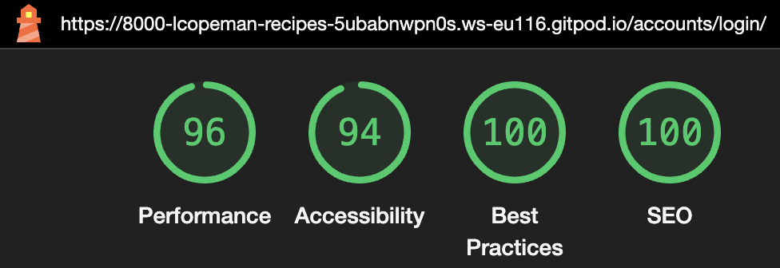
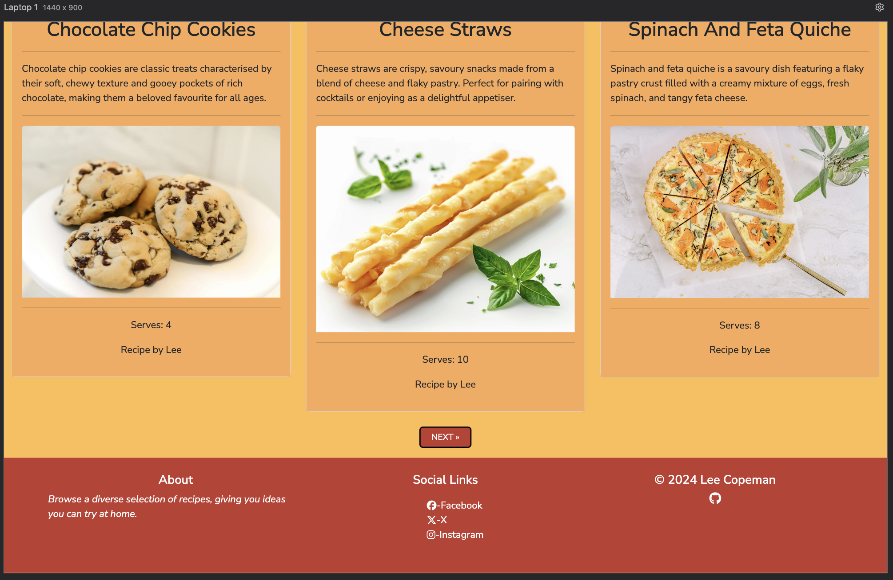

# Testing

## Manual Testing

Testing was done throughout site development, for each feature before it was merged into the master file.

Usability was tested with the below user acceptance testing, sent to new users to ensure testing from different users, on different devices and browsers to ensure issues were caught and where possible fixed during development.

|     | User Actions           | Expected Results | Y/N | Comments    |
|-------------|------------------------|------------------|------|-------------|
| Header    |                        |                  |      |             |
| 1           | Click on Home link | Home page loads | Y | Hover properties          |
| 2           | Click on Register link | Register page loads | Y | Hover properties          |
| 3          | Click on Login link | Login page loads | Y | Hover properties         |
| 4           | Click on logo | Home page loads | Y | Hover properties         |
| 5           | Click on toggle button (mobile screens) | Dropdown menu revealed | Y | Logo moves position. Not intended         |
| Footer    |                        |                  |      |             |
| 1           | Click on Facebook link | Opens page in new window | Y | Hover properties         |
| 2           | Click on X link | Opens page in new window | Y | Hover properties         |
| 3           | Click on Instagram link | Opens page in new window | Y | Hover properties         |
| 4           | Click on GitHub link | Opens page in new window | Y | Hover properties         |
| Register Page     |                        |                  |      |             |
| 1           | Click on sign in | Log in page loads | Y | If user already has an account they can log in         | 
| 2           | Enter valid username | Username accepted | Y |          |
| 3           | Enter username that already exists | Validation message | Y |          |
| 4           | Enter valid password | Password accepted | Y |          |
| 5           | Enter password too short |  Validation message | Y |          |
| 6           | Enter entirely numeric password  |  Validation message | Y | '12345678' used for test         |
| 7           | Enter password incorrectly second time |  Validation message | Y |          |
| 8           | Click Sign Up |  Account Created | Y | Log in message displayed        |
| Log In Page     |                        |                  |      |             |
| 1           | Click on sign up | Register page loads | Y | If user doesnt have an account they can sign up         | 
| 2           | Enter log in credentials | User logged in | Y | Log in message displayed         |
| 3           | Enter log in credentials incorecctly | Validation message | Y |          |
| 4           | Click Sign In | User signed in | Y | Log in message displayed         |
| Sign Out Page     |                        |                  |      |             |
| 1           | Click on sign out | User signed out | Y |          | 
| 2           | Click on cancel | User not signed out | Y |         | 
| Home Page     |                        |                  |      |             |
| 1           | Click on recipe card | Recipe feature page loads | Y | Hover properties on entire card         | 
| Comment Section     |                        |                  |      |             |
| 1           |    | Message displayed if no comments left | Y |         | 
| 2           |    | Message displayed if comments not approved | Y |         | 
| 3           | Click on log in link   | Login page loads | Y | When user logged in, comment form is visible        | 
| 4           |    | Personalised 'leave comment' message for user | Y |         | 
| 5           | Click Submit   | Message submitted | Y | Comment submitted message shows        | 
| 6           | Comment form submitted empty   | Validation message | Y |         |
| 7           | Comment form submitted only with white space   | Validation message | Y |         | 
| 8           | Comment submitted by user   | Edit and Delete buttons visible | Y |         | 
| 9           | Click on Edit   | Message to be edited populates comment form | Y |         | 
| 10          | Click on Edit   | Submit button changes to Update | Y |         | 
| 11          | Click on Edit   | Cursor focuses on comment form | Y |         | 
| 8           | Comment updated and left empty   | Validation message | Y |         | 
| 8           | Comment updated only with white space   | Validation message | Y |         | 
| 12          | Click on Delete   | Delete Modal appears | Y |         | 
| 13          | Click on Delete in modal   | Comment deleted | Y | Comment deleted message shows         | 
| 14          | Click on Close   | Comment not deleted | Y |         | 

---

## Testing User Story

| First Time Visitor Goals | Requirement met | Image |
| ------------------------- | --------------- | ----- |
| As a First Time Visitor, I can view a list of recipes so that I can select which recipe I want to view. | Three recipes are listed per page, with 'NEXT' and 'PREV' buttons allowing more pages to be viewed |  |
| As a First Time Visitor, I can click on a recipe so that I can read the full recipe. | When a recipe is clicked, the recipe feature page is loaded |  |
| As a First Time Visitor, I can register an account so that I can comment on a recipe. | The Register link can be clicked in hte header, taking the user to the register page |  |

---

| Frequent Visitor Goals | Requirement met | Image |
| ------------------------- | --------------- | ----- |
| As a Frequent User, I can leave comments on a recipe so that I can be involved in the conversation. | When users are logged in, they are able to leave a comment in the comment form below the recipe feature. |  |
| As a Frequent User, I can view comments on a recipe so that I can follow the conversation. | A user can view the comments in the comment section on the recipe feature page. |  |
| As a Frequent User,  I can modify or delete my comment so that I can be involved in the conversation. | After a user has submitted a comment, edit and delete buttons allow the comment to be modified |  |

---

| Site Admin Goals | Requirement met | Image |
| ------------------------- | --------------- | ----- |
| As Site Admin, I can create, update and delete recipes so that I can manage the content. | Via the admin panel, recipes can be created, updated and deleted. |  |
| As Site Admin,  I can view comments on a recipe so that I can follow the conversation. | Site admin can view the comments in the comment section on the recipe feature page. |  |

---

## Bugs

### Known Bugs

- After a comment has been submitted, if the page refreshes then the comment is resubmitted. I believe this happends because the browser repeats the last POST request when the page is refreshed. I would look to resolve this by redirecting the user to a different URL after the form submission.
- For moibile screens, when the toggle button is clicked the logo which is in the top-right of the page moves under the toggle button. I would look to resolve this by adjusting the layout of the header with Flex and bootstrap classes.

### Resolved Bugs

- I used an if statement to leave a message to users if there are no comments currently left. 
    -
    - This didnt take into account comments which had been left that were awaiting approval. This created an error by not displaying the message even though no comments appeared to be showing.
    - To resolves this I added an `elif` statement to acknowledge the unapproved comments.
    -      
- I was getting an error in the terminal with mixed content, where HTTP content was being loaded over HTTPS. This content was coming from CLoudinary. 
    - 
    - To resolve this I updated the settings file:
    - 

---

## Validation:

### HTML Validation:

- [index.html Validation Report](documentation/validation/index-html.png)

    - No errors or warnings were found when passing through the official [W3C](https://validator.w3.org/) validator. This checking was done manually by copying the view page source code and pasting it into the validator.

- [recipe_feature.html Validation Report](documentation/validation/feature-html.png)

    - No errors or warnings were found when passing through the official [W3C](https://validator.w3.org/) validator. This checking was done manually by copying the view page source code and pasting it into the validator.

- [signup.html Validation Report](documentation/validation/sign-up-errors.png) - ([error in code](documentation/validation/sign-up-code.png))

    - There were 4 errors found when passing through the official [W3C](https://validator.w3.org/) validator. The errors arise from Django forms interpretation of allauths helper text. Not in the code written for this project.

- [signin.html Validation Report](documentation/validation/sign-in.png)

    - No errors or warnings were found when passing through the official [W3C](https://validator.w3.org/) validator. This checking was done manually by copying the view page source code and pasting it into the validator.

- [signout.html Validation Report](documentation/validation/sign-out-html.png)

    - No errors or warnings were found when passing through the official [W3C](https://validator.w3.org/) validator. This checking was done manually by copying the view page source code and pasting it into the validator.

### CSS Validation:

- [Full CSS Validation Report](documentation/validation/css-validation.png)

- No errors or warnings were found when passing through the official [W3C (Jigsaw)](https://jigsaw.w3.org/css-validator/#validate_by_uri) validator. This checking was done manually by copying the view page source code and pasting it into the validator.

### JS Validation:

- [Full JS Validation Report](documentation/validation/jsHint.png)

- No errors or warning messages were found when passing through the official [JSHint](https://www.jshint.com/) validator. However, the error "variable bootstrap is not defined" was showing. This typically occurs because JSHint is treating bootstrap as an undefined variable, meaning it doesn't recognize where the bootstrap variable is coming from. To solve this bootstrap was declared as a global variable.

### Python Validation:

- [Recipe App admin](documentation/validation/recipe-admin-py.png)
    - No errors were found when the code was passed through Code Institutes pep8 validator [pep8 validator](). The checking was done manually by copying python code and pasting it into the validator.
- [Recipe App apps](documentation/validation/recipe-app-py.png)
    - No errors were found when the code was passed through Code Institutes pep8 validator [pep8 validator](). The checking was done manually by copying python code and pasting it into the validator.
- [Recipe App forms](documentation/validation/recipe-forms-py.png)
    - No errors were found when the code was passed through Code Institutes pep8 validator [pep8 validator](). The checking was done manually by copying python code and pasting it into the validator.
- [Recipe App models](documentation/validation/recipe-model-py.png)
    - No errors were found when the code was passed through Code Institutes pep8 validator [pep8 validator](). The checking was done manually by copying python code and pasting it into the validator.
- [Recipe App urls](documentation/validation/recipe-urls-py.png)
    - No errors were found when the code was passed through Code Institutes pep8 validator [pep8 validator](). The checking was done manually by copying python code and pasting it into the validator.
- [Recipe App views](documentation/validation/recipe-views-py.png)
    - No errors were found when the code was passed through Code Institutes pep8 validator [pep8 validator](). The checking was done manually by copying python code and pasting it into the validator.
- [Project Recipe urls](documentation/validation/project-urls-py.png)
    - No errors were found when the code was passed through Code Institutes pep8 validator [pep8 validator](). The checking was done manually by copying python code and pasting it into the validator.

---
## Lighthouse Report

### Home Page

### Recipe Feature Page

### Sign Up Page

### Sign In Page

### Sign Out Page

---

## Responsiveness

The responsiveness was checked manually by using devtools (Chrome) throughout the whole development. It was also checked with [Responsive Viewer](https://chrome.google.com/webstore/detail/responsive-viewer/inmopeiepgfljkpkidclfgbgbmfcennb/related?hl=en) Chrome extension.

### Home Page

#### Mobile Screens

#### Tablet Screens

#### Large Screens

---

### Recipe Feature Page

#### Mobile Screens

#### Tablet Screens

#### Large Screens

---

### Register Page

#### Mobile Screens

#### Tablet Screens

#### Large Screens

---

### Sign In Page

#### Mobile Screens

#### Tablet Screens

#### Large Screens

---

### Sign Out Page

#### Mobile Screens

#### Tablet Screeens

#### Large Screens

---

## Compatibility

Testing was conducted on the following browsers;

- Chrome
- Firefox
- Safari

